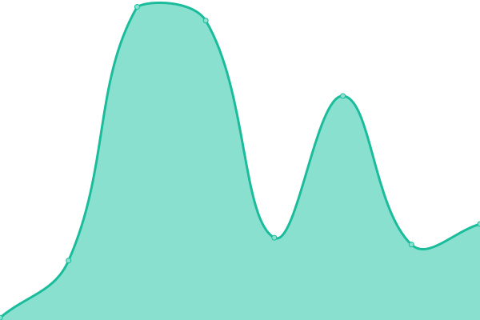
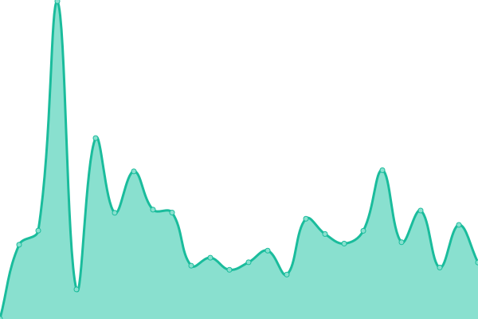

# [📈 Live Status](https://AaravMehta59.github.io/web-monitor): <!--live status--> **🟩 All systems operational**

This repository contains the open-source uptime monitor and status page for [Aarav Mehta](https://itzaarav.netlify.app/), powered by [Upptime](https://github.com/upptime/upptime).

With [Upptime](https://upptime.js.org), you can get your own unlimited and free uptime monitor and status page, powered entirely by a GitHub repository. We use [Issues](https://github.com/AaravMehta59/web-monitor/issues) as incident reports, [Actions](https://github.com/AaravMehta59/web-monitor/actions) as uptime monitors, and [Pages](https://AaravMehta59.github.io/web-monitor) for the status page.

<!--start: status pages-->
<!-- This summary is generated by Upptime (https://github.com/upptime/upptime) -->
<!-- Do not edit this manually, your changes will be overwritten -->
<!-- prettier-ignore -->
| URL | Status | History | Response Time | Uptime |
| --- | ------ | ------- | ------------- | ------ |
|  [Giva Bot Backend](https://giva-bot.thenuggetlabs.repl.co) | 🟩 Up | [giva-bot-backend.yml](https://github.com/AaravMehta59/web-monitor/commits/HEAD/history/giva-bot-backend.yml) | 

 375ms
     
 | 

<a href="https://AaravMehta59.github.io/web-monitor/history/giva-bot-backend">100.00%</a>
    

|  [The Nugget Labs Site](https://thenuggetlabs.repl.co/) | 🟩 Up | [the-nugget-labs-site.yml](https://github.com/AaravMehta59/web-monitor/commits/HEAD/history/the-nugget-labs-site.yml) | 

 354ms
     
 | 

<a href="https://AaravMehta59.github.io/web-monitor/history/the-nugget-labs-site">100.00%</a>
    

|  [My Personal Site](https://itzaarav.netlify.app/) | 🟩 Up | [my-personal-site.yml](https://github.com/AaravMehta59/web-monitor/commits/HEAD/history/my-personal-site.yml) | 

 179ms
     
 | 

<a href="https://AaravMehta59.github.io/web-monitor/history/my-personal-site">100.00%</a>
    

|  [Assist Dead Bot](https://axrxvs-assistant.thenuggetlabs.repl.co) | 🟩 Up | [assist-dead-bot.yml](https://github.com/AaravMehta59/web-monitor/commits/HEAD/history/assist-dead-bot.yml) | 

 620ms
     
 | 

<a href="https://AaravMehta59.github.io/web-monitor/history/assist-dead-bot">99.62%</a>
    

|  [Axis API Endpoint (ver)](https://api.thenuggetlabs.repl.co/version) | 🟩 Up | [axis-api-endpoint-ver.yml](https://github.com/AaravMehta59/web-monitor/commits/HEAD/history/axis-api-endpoint-ver.yml) | 

 319ms
     
 | 

<a href="https://AaravMehta59.github.io/web-monitor/history/axis-api-endpoint-ver">100.00%</a>
    

<!--end: status pages-->

[**Visit our status website →**](https://AaravMehta59.github.io/web-monitor)

## 📄 License

- Powered by: [Upptime](https://github.com/upptime/upptime)
- Code: [MIT](./LICENSE) © [Aarav Mehta](https://itzaarav.netlify.app/)
- Data in the `./history` directory: [Open Database License](https://opendatacommons.org/licenses/odbl/1-0/)
